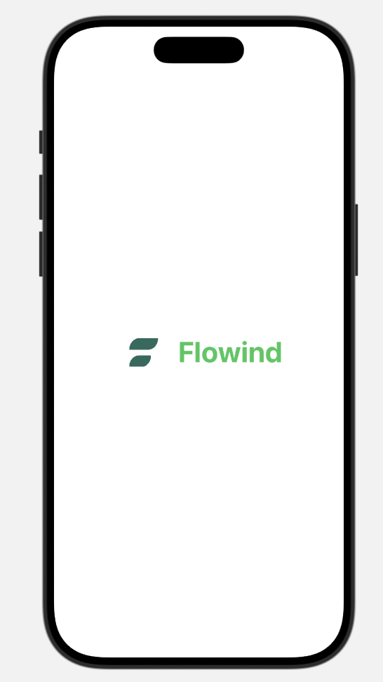

# Flowind

Flowind is a SwiftUI-based mobile application designed to enhance productivity through a seamless user experience. The app integrates Firebase for authentication and provides a smooth onboarding process for new users.

## Features

- **Splash Screen**: A welcoming splash screen with a logo animation that transitions to the onboarding screen.
- **Onboarding**: Introduces users to the app's features and guides them to the signup process.
- **Signup/Login**: Allows users to create an account or log in using their email. The app also supports social logins via Google and Apple.
- **Firebase Authentication**: Utilizes FirebaseAuth for secure user authentication.

## ScreenShots

<div style="display: flex; justify-content: space-around;">
    
    
    
    
</div>


## Installation

1. Clone the repository:
   ```bash
   git clone https://github.com/aditya072690/flowind.git
   ```
2. Open the project in Xcode.
3. Ensure you have the latest version of Xcode and Swift installed.
4. Set up Firebase in your project:
   - Follow the [Firebase setup guide](https://firebase.google.com/docs/ios/setup) to add Firebase to your iOS app.
   - Ensure you have the `GoogleService-Info.plist` file in your project.

## Usage

- Run the app on a simulator or a physical device.
- Navigate through the splash, onboarding, and authentication screens.
- Use the signup or login features to authenticate users.

## Dependencies

- **SwiftUI**: For building the user interface.
- **Firebase**: For authentication services.
- **Lottie**: For animations (if used in the splash screen).

## Contributing

Contributions are welcome! Please fork the repository and submit a pull request for any improvements or bug fixes.
